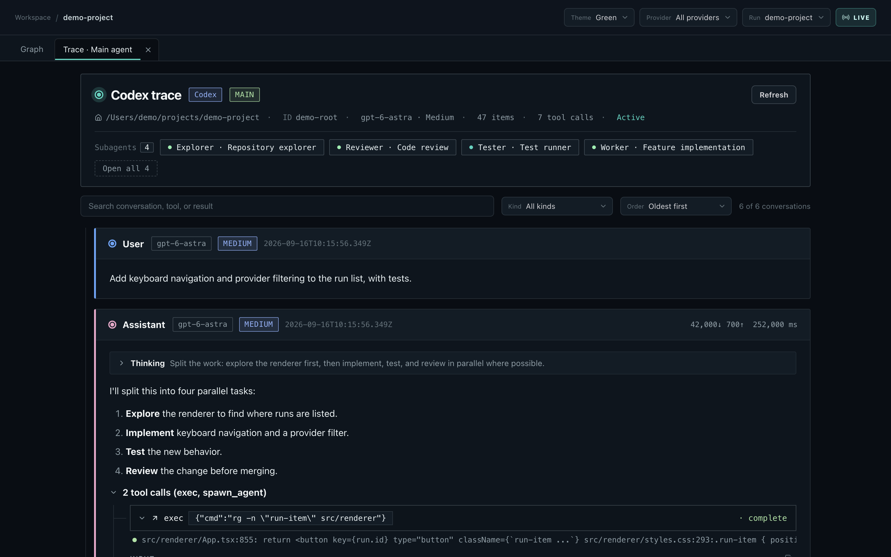
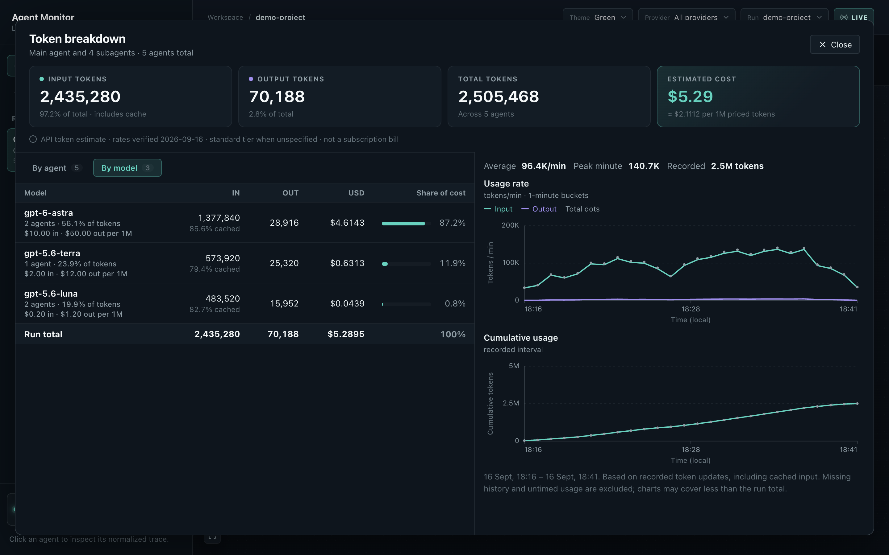

# Agent Monitor

A local dashboard for **Codex, Claude Code, Pi, and Hermes**. Explore agent trees, read traces, and track token usage and estimated costs. Traces stay on your machine.


## Run

Requires **Node.js 22.12+** and npm.

```sh
git clone https://github.com/donvito/agent-monitor.git
cd agent-monitor
npm install
npm run dev
```

Select a run from the sidebar to load its agents. Click an agent to inspect its trace, or use the icon on its node to open the trace in a tab. Click **Details** next to the token totals for the full breakdown.

Default sources:

| Provider | Local source |
| --- | --- |
| Codex | `$CODEX_HOME/sessions` or `~/.codex/sessions` |
| Claude Code | `$CLAUDE_CONFIG_DIR/projects` or `~/.claude/projects` |
| Pi | `$PI_CODING_AGENT_DIR/sessions` or `~/.pi/agent/sessions` |
| Hermes | `$HERMES_HOME/state.db`, `session-exports/traces`, and `sessions`, defaulting to `~/.hermes` |

## Trace view

Open any agent in a tab to read its conversation, tool calls, and results, with links to its parent and subagents.



## Token breakdown

Token totals and estimated API cost per agent, with usage charts over time.


Switch to **By model** to see tokens and cost grouped by model.



*Screenshots use synthetic demo sessions.*

## More

- [Using the dashboard](docs/usage.md)
- [Discovery, configuration, and privacy](docs/discovery-and-privacy.md)
- [Development and production builds](docs/development.md)
- [Pricing sources and assumptions](docs/token-pricing.md)
- [Product specification](SPEC.md)
