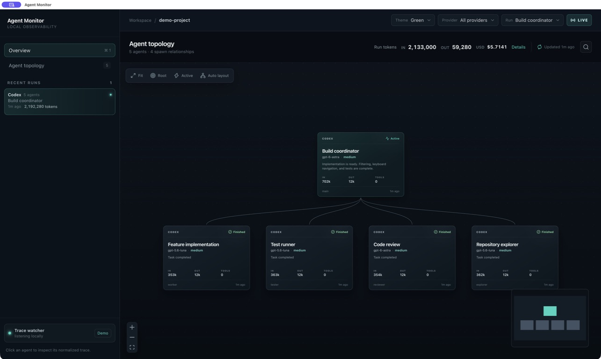
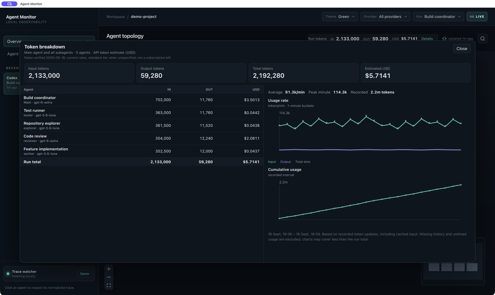

# Agent Monitor

A local dashboard for **Codex, Claude Code, Pi, and Hermes**. Explore agent trees, read traces, and track token usage and estimated costs. Traces stay on your machine.



## Run

Requires **Node.js 22.12+** and npm.

```sh
git clone https://github.com/donvito/agent-monitor.git
cd agent-monitor
npm install
npm run dev
```

Select a run from the sidebar to load its agents. Click an agent to inspect its trace, or the token totals for usage details.



*Screenshots use synthetic demo sessions.*

## More

- [Using the dashboard](docs/usage.md)
- [Discovery, configuration, and privacy](docs/discovery-and-privacy.md)
- [Development and production builds](docs/development.md)
- [Pricing sources and assumptions](docs/token-pricing.md)
- [Product specification](SPEC.md)
